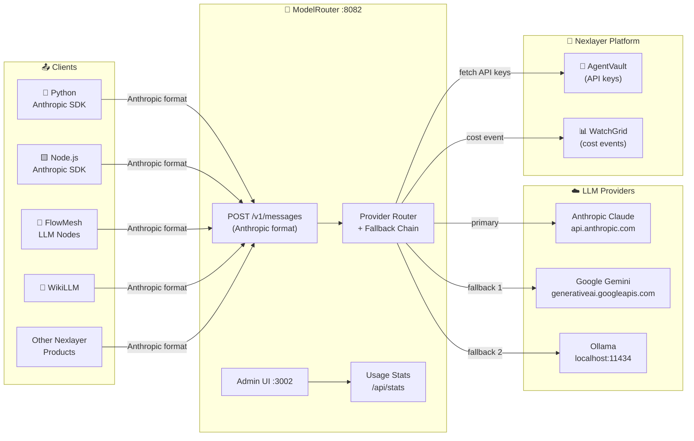
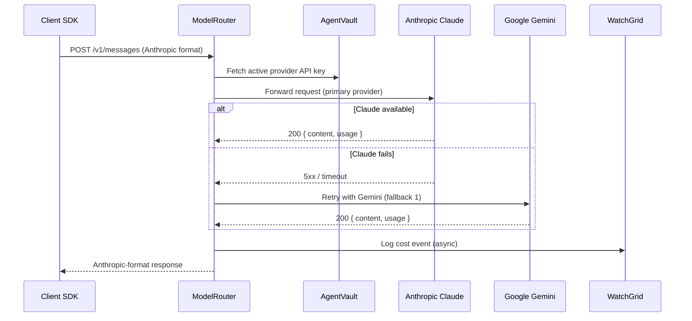

<div align="center">

# 🔀 ModelRouter

### *Drop-In Anthropic-Compatible LLM Gateway*

[](https://github.com)
[](https://github.com)
[](LICENSE)
[](https://openjdk.org/)
[](https://spring.io/)
[](https://anthropic.com)
[](https://ai.google.dev)
[](https://ollama.ai)

```
Your code  →  POST /v1/messages  →  ModelRouter  →  Claude / Gemini / Ollama
```

**Change your LLM provider platform-wide with a single config change — no code edits.**  
**All 8 Nexlayer products point here. One gateway to rule them all.**

[Quick Start](#-quick-start) · [API Reference](#-api-reference) · [Provider Setup](#-provider-setup) · [Architecture](#️-architecture)

</div>

---

## 📋 Table of Contents

- [✨ Features](#-features)
- [🏗️ Architecture](#️-architecture)
- [🚀 Quick Start](#-quick-start)
- [📡 API Reference](#-api-reference)
- [🔧 SDKs & Language Examples](#-sdks--language-examples)
- [⚙️ Provider Setup](#️-provider-setup)
- [💡 Why ModelRouter?](#-why-modelrouter)
- [🔀 Integrations](#-integrations)
- [🤖 Claude Code / MCP](#-claude-code--mcp)
- [📊 Configuration](#-configuration)
- [🧑‍💻 Development](#-development)
- [📄 License](#-license)

---

## ✨ Features

| Feature | Description |
|---------|-------------|
| 🔌 **Drop-in Compatible** | Speaks the Anthropic Messages API — swap `base_url` and you're done |
| 🔄 **Provider Fallback Chain** | Claude fails → try Gemini → try Ollama — automatic, configurable |
| 🌐 **3 Providers** | Anthropic Claude, Google Gemini, Ollama (local, zero cost) |
| 💰 **Unified Cost Tracking** | Token counts and USD cost aggregated across all providers |
| 🎛️ **Admin UI** | Switch providers, configure keys, and view usage stats from a browser |
| 📊 **Usage Stats API** | Per-model, per-provider token and cost breakdown |
| 🔑 **AgentVault Integration** | Provider API keys stored and fetched from AgentVault |
| 📡 **WatchGrid Integration** | Every LLM call cost event logged to WatchGrid automatically |
| ⚡ **Zero Code Changes** | Set two env vars — your existing Anthropic SDK code works unchanged |

---

## 🏗️ Architecture



### Request Routing Flow



---

## 🚀 Quick Start

### 1. Start ModelRouter

```bash
git clone https://github.com/nexlayer/modelrouter
cd modelrouter
docker compose up -d
```

### 2. Verify it's running

```bash
curl http://localhost:8082/v1/health
# {"status":"ok","service":"ModelRouter"}
```

### 3. Configure a provider (one-time setup)

```bash
# Set your Anthropic API key
curl -s -X PUT http://localhost:8082/api/admin/config \
  -H "Content-Type: application/json" \
  -d '{"anthropicApiKey": "sk-ant-YOUR-KEY-HERE"}'

# Optionally add Gemini as fallback
curl -s -X PUT http://localhost:8082/api/admin/config \
  -H "Content-Type: application/json" \
  -d '{"geminiApiKey": "AIzaSy-YOUR-KEY", "geminiModel": "gemini-2.0-flash"}'
```

### 4. Send your first message

```bash
curl -X POST http://localhost:8082/v1/messages \
  -H "Content-Type: application/json" \
  -H "x-api-key: any-string" \
  -d '{
    "model": "claude-sonnet-4-20250514",
    "max_tokens": 256,
    "messages": [{"role": "user", "content": "Reply with one word: working"}]
  }' | jq '.content[0].text'
# "Working"
```

> **That's it.** Every Nexlayer product using `ANTHROPIC_BASE_URL=http://localhost:8082` now routes through ModelRouter. Switch providers in the Admin UI — no code changes anywhere. 🎉

---

## 📡 API Reference

### LLM Endpoint — public (no auth)

| Method | Endpoint | Description |
|--------|----------|-------------|
| `POST` | `/v1/messages` | Main LLM call — Anthropic Messages API format |
| `GET` | `/v1/models` | List available model identifiers |
| `GET` | `/v1/health` | Health check |

### Admin Endpoints

| Method | Endpoint | Description |
|--------|----------|-------------|
| `GET` | `/api/admin/config` | Get current config (keys redacted) |
| `PUT` | `/api/admin/config` | Update API keys, models, Ollama URL |
| `POST` | `/api/admin/provider/switch` | Switch active provider `{ provider: "anthropic\|gemini\|ollama" }` |
| `GET` | `/api/stats` | Usage stats per model/provider |
| `POST` | `/api/providers` | Register a provider configuration |

<details>
<summary>📋 Full request/response reference</summary>

#### POST /v1/messages — Request
```json
{
  "model": "claude-sonnet-4-20250514",
  "max_tokens": 1024,
  "messages": [
    { "role": "user", "content": "Hello!" }
  ],
  "system": "You are a helpful assistant.",
  "temperature": 0.7
}
```

> **Note:** The `model` field is accepted for compatibility but ignored — the router uses the configured active provider's model.

#### POST /v1/messages — Response
```json
{
  "id": "msg_01XF...",
  "type": "message",
  "role": "assistant",
  "content": [{ "type": "text", "text": "Hello! How can I help?" }],
  "model": "claude-sonnet-4-20250514",
  "stop_reason": "end_turn",
  "usage": {
    "input_tokens": 14,
    "output_tokens": 9
  }
}
```

#### Provider capability matrix
| Feature | Anthropic | Gemini | Ollama |
|---------|-----------|--------|--------|
| Text chat | ✅ | ✅ | ✅ |
| System prompts | ✅ | ✅* | ✅ |
| Multi-turn history | ✅ | ✅ | ✅ |
| Token usage counts | ✅ | ✅ | ✅ |
| Tool / function calls | ✅ | ❌ | ❌ |
| Streaming | ❌ planned | ❌ | ❌ |
| Vision / images | ❌ planned | ❌ | ❌ |

*Gemini: system prompts auto-converted to user turn

</details>

---

## 🔧 SDKs & Language Examples

### 🐍 Python — Anthropic SDK (recommended)

```python
import anthropic
import os

# Two env vars — that's the entire integration
client = anthropic.Anthropic(
    api_key=os.environ.get("ANTHROPIC_API_KEY", "router"),
    base_url=os.environ.get("ANTHROPIC_BASE_URL", "http://localhost:8082"),
)

message = client.messages.create(
    model="claude-sonnet-4-20250514",
    max_tokens=1024,
    messages=[{"role": "user", "content": "Summarise today's AI news in 3 bullets."}]
)
print(message.content[0].text)
```

```bash
# .env — set once, works across all your projects
ANTHROPIC_API_KEY=router
ANTHROPIC_BASE_URL=http://localhost:8082
```

### 🟨 Node.js / TypeScript

```typescript
import Anthropic from '@anthropic-ai/sdk';

const client = new Anthropic({
  apiKey: process.env.ANTHROPIC_API_KEY ?? 'router',
  baseURL: process.env.ANTHROPIC_BASE_URL ?? 'http://localhost:8082',
});

const message = await client.messages.create({
  model: 'claude-sonnet-4-20250514',
  max_tokens: 1024,
  messages: [{ role: 'user', content: 'Hello from Node.js!' }],
});

console.log(message.content[0].text);
```

### 🐹 Go

```go
package main

import (
    "bytes"
    "encoding/json"
    "fmt"
    "io"
    "net/http"
)

func main() {
    payload, _ := json.Marshal(map[string]any{
        "model":      "claude-sonnet-4-20250514",
        "max_tokens": 1024,
        "messages":   []map[string]string{{"role": "user", "content": "Hello!"}},
    })

    req, _ := http.NewRequest("POST", "http://localhost:8082/v1/messages", bytes.NewBuffer(payload))
    req.Header.Set("Content-Type", "application/json")
    req.Header.Set("x-api-key", "router")

    resp, _ := http.DefaultClient.Do(req)
    defer resp.Body.Close()
    body, _ := io.ReadAll(resp.Body)
    fmt.Println(string(body))
}
```

### ☕ Java (Spring WebClient)

```java
WebClient client = WebClient.builder()
    .baseUrl("http://localhost:8082")
    .defaultHeader("x-api-key", "router")
    .defaultHeader("Content-Type", "application/json")
    .build();

Map<String, Object> body = Map.of(
    "model", "claude-sonnet-4-20250514",
    "max_tokens", 1024,
    "messages", List.of(Map.of("role", "user", "content", "Hello from Java!"))
);

JsonNode response = client.post()
    .uri("/v1/messages")
    .bodyValue(body)
    .retrieve()
    .bodyToMono(JsonNode.class)
    .block();

System.out.println(response.path("content").get(0).path("text").asText());
```

### 🦜 LangChain (Python)

```python
from langchain_anthropic import ChatAnthropic

llm = ChatAnthropic(
    model="claude-sonnet-4-20250514",
    anthropic_api_key="router",
    anthropic_api_url="http://localhost:8082",
)

response = llm.invoke("Explain RAG in one sentence.")
print(response.content)
```

### 🔵 cURL (CI / shell scripts)

```bash
# One-liner helper
mr() {
  curl -sf -X POST http://localhost:8082/v1/messages \
    -H "Content-Type: application/json" \
    -H "x-api-key: router" \
    -d "{\"model\":\"claude-sonnet-4-20250514\",\"max_tokens\":512,\"messages\":[{\"role\":\"user\",\"content\":\"$1\"}]}" \
    | jq -r '.content[0].text'
}

mr "Write a one-line git commit message for: fixed null pointer in auth"
mr "Summarise this PR description in 20 words: $(cat pr_body.txt)"
```

---

## ⚙️ Provider Setup

### Switch providers

```bash
# Switch to Anthropic Claude (default)
curl -s -X POST http://localhost:8082/api/admin/provider/switch \
  -H "Content-Type: application/json" \
  -d '{"provider": "anthropic"}' | jq .provider

# Switch to Google Gemini (fast + cheap)
curl -s -X POST http://localhost:8082/api/admin/provider/switch \
  -H "Content-Type: application/json" \
  -d '{"provider": "gemini"}' | jq .provider

# Switch to Ollama (local, zero cost, zero latency)
curl -s -X POST http://localhost:8082/api/admin/provider/switch \
  -H "Content-Type: application/json" \
  -d '{"provider": "ollama"}' | jq .provider
```

### Configure API keys

```bash
# Anthropic
curl -s -X PUT http://localhost:8082/api/admin/config \
  -H "Content-Type: application/json" \
  -d '{"anthropicApiKey": "sk-ant-YOUR-KEY"}'

# Gemini
curl -s -X PUT http://localhost:8082/api/admin/config \
  -H "Content-Type: application/json" \
  -d '{"geminiApiKey": "AIzaSy-YOUR-KEY", "geminiModel": "gemini-2.0-flash"}'

# Ollama (if running locally)
curl -s -X PUT http://localhost:8082/api/admin/config \
  -H "Content-Type: application/json" \
  -d '{"ollamaBaseUrl": "http://localhost:11434", "ollamaModel": "llama3"}'
```

### Troubleshooting

| Symptom | Fix |
|---------|-----|
| `connection refused` | Check `docker compose ps` — is backend container running? |
| `422` + "API key not configured" | Set key via Admin UI or `PUT /api/admin/config` |
| `502 Bad Gateway` from Gemini/Anthropic | Verify the upstream API key is valid |
| Ollama returns empty text | Pull the model: `ollama pull llama3` |
| Slow responses | Switch to Ollama (local, no network) or Gemini Flash |

---

## 💡 Why ModelRouter?

| | ModelRouter | LiteLLM | OpenRouter | Direct Anthropic SDK |
|---|---|---|---|---|
| **Drop-in Anthropic compatible** | ✅ | ⚠️ Different API | ✅ | ✅ |
| **Self-hosted** | ✅ Docker | ✅ Complex | ❌ Cloud only | N/A |
| **Provider fallback** | ✅ Auto | ✅ Config | ❌ | ❌ |
| **Platform-wide routing** | ✅ One config | ⚠️ Per-service | N/A | ❌ Per-service |
| **Ollama support** | ✅ | ✅ | ❌ | ❌ |
| **Admin UI** | ✅ React | ❌ CLI only | ✅ Cloud | ❌ |
| **Cost tracking** | ✅ | ✅ | ✅ | ❌ |
| **WatchGrid integration** | ✅ Native | ❌ | ❌ | ❌ |
| **Setup time** | 🟢 `docker compose up` | 🟡 pip + config | 🟢 SaaS | 🟢 pip only |

---

## 🔀 Integrations

ModelRouter sits at the center of the Nexlayer LLM stack. Every product that makes LLM calls goes through here.

| Direction | Product | Integration |
|-----------|---------|-------------|
| ⬅️ Receives from | 🌊 **FlowMesh** | All LLM node calls route through ModelRouter |
| ⬅️ Receives from | 🤖 **AgentShop** | All deployed agents use ModelRouter as their LLM endpoint |
| ⬅️ Receives from | 📡 **WikiLLM** | Knowledge synthesis LLM calls |
| ⬅️ Receives from | 🧠 **BrainVault** | Memory embedding and retrieval LLM calls |
| ➡️ Logs cost to | 📊 **WatchGrid** | Every call emits a cost event asynchronously |
| ➡️ Reads keys from | 🔐 **AgentVault** | Provider API keys fetched at startup and on switch |

```bash
# Standard env pattern — set this in every Nexlayer product
ANTHROPIC_API_KEY=router
ANTHROPIC_BASE_URL=http://modelrouter:8082
```

---

## 🤖 Claude Code / MCP

Point Claude Code itself at ModelRouter — all Claude Code LLM calls will route through your local gateway:

```bash
# Set in your shell profile
export ANTHROPIC_API_KEY=router
export ANTHROPIC_BASE_URL=http://localhost:8082
```

Or via MCP tool for admin operations:

```json
// ~/.claude/mcp.json
{
  "mcpServers": {
    "modelrouter": {
      "command": "npx",
      "args": ["@nexlayer/modelrouter-mcp"],
      "env": {
        "MODELROUTER_URL": "http://localhost:8082"
      }
    }
  }
}
```

**Available MCP tools:**
- `modelrouter_get_status` — current active provider and config
- `modelrouter_switch_provider` — switch to anthropic/gemini/ollama
- `modelrouter_get_stats` — token and cost usage per model
- `modelrouter_set_api_key` — configure a provider API key

---

## 📊 Configuration

| Variable | Default | Description |
|----------|---------|-------------|
| `SERVER_PORT` | `8082` | API server port |
| `ACTIVE_PROVIDER` | `anthropic` | Default provider: `anthropic`, `gemini`, or `ollama` |
| `ANTHROPIC_API_KEY` | — | Anthropic API key (or set via Admin UI) |
| `GEMINI_API_KEY` | — | Google Gemini API key (or set via Admin UI) |
| `GEMINI_MODEL` | `gemini-2.0-flash` | Gemini model identifier |
| `OLLAMA_BASE_URL` | `http://localhost:11434` | Ollama server URL |
| `OLLAMA_MODEL` | `llama3` | Ollama model name |
| `FALLBACK_ENABLED` | `true` | Enable provider fallback chain |
| `WATCHGRID_URL` | `http://localhost:8085` | WatchGrid URL for cost event logging |
| `AGENTVAULT_URL` | `http://localhost:8083` | AgentVault URL for API key retrieval |
| `CORS_ALLOWED_ORIGINS` | `http://localhost:3002` | Frontend CORS origin |

> Config persists in a Docker volume (`modelrouter-data`) — survives container restarts and redeployments.

---

## 🧑‍💻 Development

### Prerequisites

- Java 21 + Maven 3.9+
- Node.js 18+

### Backend

```bash
cd backend
mvn spring-boot:run
# API at http://localhost:8082
```

### Frontend

```bash
cd frontend
npm install
npm run dev
# Admin UI at http://localhost:3002
```

### Tests

```bash
cd backend && mvn test
```

<details>
<summary>📁 Project structure</summary>

```
modelrouter/
├── backend/
│   └── src/main/java/
│       ├── controller/     # MessagesController, AdminController, StatsController
│       ├── service/        # RouterService, ProviderService, FallbackChain, StatsService
│       ├── provider/       # AnthropicProvider, GeminiProvider, OllamaProvider
│       └── model/          # ProviderConfig, UsageStat (JPA entities)
├── frontend/
│   └── src/
│       ├── pages/          # Dashboard, Config, Stats
│       └── components/     # ProviderSelector, StatsChart, ConfigForm
└── docker-compose.yml
```

</details>

---

## 📄 License

MIT © Nexlayer — see [LICENSE](LICENSE) for details.

---

<div align="center">

**Part of the Nexlayer AI Platform**

[🔐 AgentVault](../AgentVault) · [🌊 FlowMesh](../flowmesh) · [📊 WatchGrid](../watchgrid) · [🧠 BrainVault](../BrainVault) · [🤖 AgentShop](../AIAgentRental)

*Built with ☕ Java 21 + Spring Boot 3 · ⚛️ React 18 · Routes to Claude · Gemini · Ollama*

</div>
